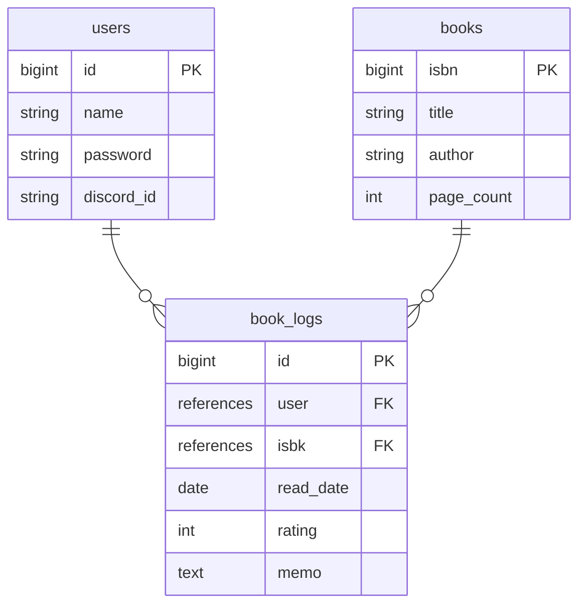

# E-R図

初期段階ではコミュニティ等は特に設けず、読書ログを管理だけを目的とする。

```mermaid
erDiagram

users ||--o{ book_logs: ""
books ||--o{ book_logs: ""

users {
  bigint id PK
  string name 
  string password
  string discord_id
}

books {
    bigint isbn PK
    string title
    string author
    int page_count
}

book_logs {
  bigint id PK
  references user FK
  references isbk FK
  date read_date
  int rating
  text memo
}


```

